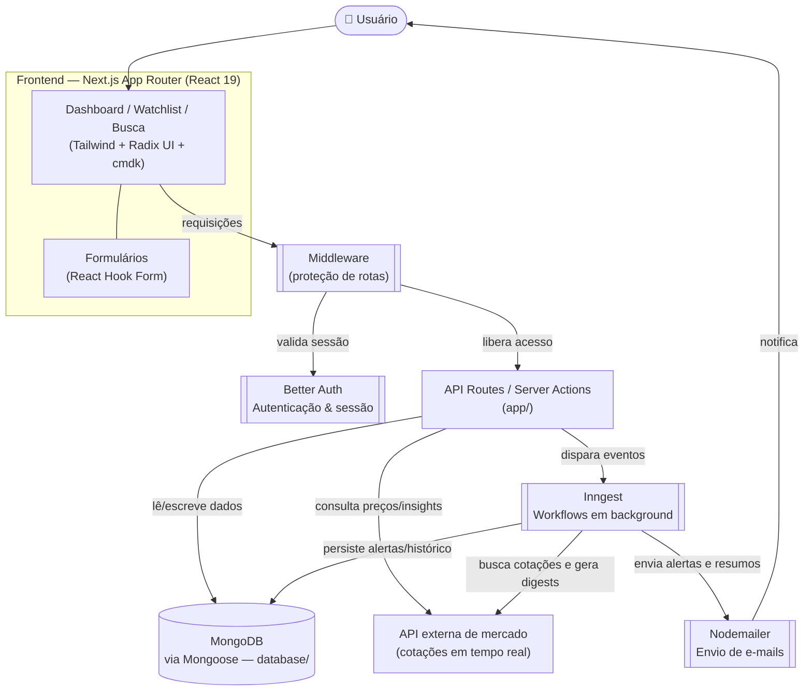

<div align="center">

# 📈 Signalist

### Plataforma de rastreamento de ações em tempo real, alertas personalizados e insights de empresas

[](https://nextjs.org)
[](https://react.dev)
[](https://www.typescriptlang.org)
[](https://www.mongodb.com)
[](https://www.better-auth.com)
[](https://www.inngest.com)
[](https://nextjs-stock-three.vercel.app)

</div>

---

## 📋 Sobre o projeto

**Signalist** é uma aplicação full-stack construída com **Next.js 15 (App Router)** que permite acompanhar preços de ações em tempo real, criar **alertas personalizados** e explorar **insights detalhados de empresas**. O projeto combina dados de mercado, autenticação de usuários, workflows orientados a eventos e notificações por e-mail em uma única plataforma.

> 💡 Este README foi elaborado com base no `package.json`, na estrutura de pastas públicas do repositório e no projeto de referência em que o Signalist é baseado ([`adrianhajdin/signalist_stock-tracker-app`](https://github.com/adrianhajdin/signalist_stock-tracker-app)). Ajuste os detalhes finos conforme a implementação real do seu fork.

**🔗 Demo:** [nextjs-stock-three.vercel.app](https://nextjs-stock-three.vercel.app)

---

## ✨ Funcionalidades

| Funcionalidade | Descrição |
|---|---|
| 📊 **Dashboard de ações** | Acompanhamento de preços em tempo real com gráficos interativos, filtráveis por setor, desempenho ou capitalização de mercado |
| 🔍 **Busca inteligente** | Localização rápida de ativos por ticker ou nome da empresa |
| ⭐ **Watchlist & Alertas** | Criação de listas de acompanhamento personalizadas e alertas de preço com notificação por e-mail |
| 🏢 **Insights de empresas** | Dados financeiros detalhados, ratings de analistas e indicadores fundamentais |
| ⚙️ **Workflows em tempo real** | Automação de atualizações de preço, geração de relatórios e resumos via Inngest |
| 📩 **Digests e notificações** | Resumos diários, alertas de earnings e notificações customizáveis por e-mail (Nodemailer) |
| 🔐 **Autenticação segura** | Login/sessão gerenciados via Better Auth, com rotas protegidas por middleware |

---

## 🛠️ Tech Stack

| Camada | Tecnologia |
|---|---|
| **Framework** | Next.js 15 (App Router, Turbopack) |
| **UI** | React 19, Tailwind CSS 4, Radix UI, `cmdk` (command palette), `sonner` (toasts) |
| **Formulários** | React Hook Form |
| **Autenticação** | Better Auth |
| **Banco de dados** | MongoDB + Mongoose (ODM) |
| **Jobs / Eventos** | Inngest (workflows assíncronos e orientados a eventos) |
| **E-mail** | Nodemailer |
| **Dados de mercado** | API externa de cotações (ex.: Finnhub) |
| **Linguagem** | TypeScript 5 |

---

## 🏗️ Arquitetura



### Como funciona o fluxo

1. **Usuário** acessa o dashboard, busca ativos e monta sua *watchlist* pela interface Next.js/React.
2. O **middleware** intercepta as requisições e valida a sessão junto ao **Better Auth**, protegendo rotas autenticadas (ex.: `/dashboard`, `/watchlist`).
3. As **API Routes / Server Actions** (dentro de `app/`) tratam a lógica de negócio, lendo e gravando dados no **MongoDB** através dos modelos Mongoose (`database/`).
4. Consultas de preços e dados de empresas são feitas a uma **API externa de mercado** (cotações em tempo real).
5. Eventos como "novo alerta criado" ou "preço atingiu o limite" são publicados no **Inngest**, que orquestra workflows assíncronos: monitoramento periódico de preços, geração de resumos/digests e verificação de condições de alerta.
6. Quando um workflow do Inngest identifica que uma notificação deve ser enviada, ele aciona o **Nodemailer** para disparar o e-mail (alerta de preço, digest diário, notificação de earnings) ao usuário.

> Ajuste as setas e nomes de serviços conforme a implementação exata do seu fork — em particular, confirme qual provedor de dados de mercado e qual serviço SMTP estão configurados no projeto.

---

## 📁 Estrutura do projeto

```
nextjs-stock/
├── app/                  # Rotas, páginas e layouts (Next.js App Router)
├── components/           # Componentes de UI reutilizáveis (shadcn/Radix)
├── database/             # Conexão com MongoDB e modelos Mongoose
├── hooks/                # React hooks customizados
├── lib/                  # Funções utilitárias, clients de API, configs (ex.: Better Auth, Inngest)
├── middleware/            # Middleware de proteção de rotas
├── public/assets/        # Imagens, ícones e assets estáticos
├── scripts/               # Scripts utilitários (ex.: test-db.mjs)
├── types/                 # Tipagens TypeScript compartilhadas
├── components.json        # Configuração do shadcn/ui
├── next.config.ts
├── eslint.config.mjs
├── postcss.config.mjs
├── tsconfig.json
├── package.json
└── README.md
```

---

## ⚙️ Pré-requisitos

- **Node.js** 20+
- Um gerenciador de pacotes: `npm`, `yarn`, `pnpm` ou `bun`
- Uma instância **MongoDB** (local ou Atlas)
- Chave de API de um provedor de dados de mercado (ex.: Finnhub)
- Credenciais SMTP para envio de e-mail (Nodemailer)
- Conta no **Inngest** (para orquestração de workflows)

---

## 🔑 Variáveis de ambiente

Crie um arquivo `.env` (ou `.env.local`) na raiz do projeto:

```bash
NODE_ENV=development
NEXT_PUBLIC_BASE_URL=http://localhost:3000

# MongoDB
MONGODB_URI=

# Better Auth
BETTER_AUTH_SECRET=
BETTER_AUTH_URL=http://localhost:3000

# Provedor de dados de mercado
NEXT_PUBLIC_FINNHUB_API_KEY=
FINNHUB_BASE_URL=https://finnhub.io/api/v1

# E-mail (Nodemailer)
NODEMAILER_EMAIL=
NODEMAILER_PASSWORD=

# Inngest
INNGEST_EVENT_KEY=
INNGEST_SIGNING_KEY=
```

> Nomes exatos das variáveis podem variar — confirme em `lib/` e `database/` do repositório.

---

## 🚀 Instalação e execução local

```bash
# 1. Clone o repositório
git clone https://github.com/renatomf/nextjs-stock.git
cd nextjs-stock

# 2. Instale as dependências
npm install

# 3. Configure o .env (veja seção acima)

# 4. Teste a conexão com o banco (opcional)
npm run test:db

# 5. Rode o servidor de desenvolvimento
npm run dev

# 6. Em outro terminal, rode o Inngest Dev Server (para os workflows)
npx inngest-cli dev
```

Abra [http://localhost:3000](http://localhost:3000) no navegador.

---

## 📜 Scripts disponíveis

| Comando | Descrição |
|---|---|
| `npm run dev` | Inicia o servidor de desenvolvimento (Turbopack) |
| `npm run build` | Gera o build de produção (Turbopack) |
| `npm run start` | Inicia o servidor em modo produção |
| `npm run lint` | Roda o ESLint no projeto |
| `npm run test:db` | Testa a conexão com o MongoDB (`scripts/test-db.mjs`) |

---

## ☁️ Deploy

O projeto está publicado na **Vercel**: [nextjs-stock-three.vercel.app](https://nextjs-stock-three.vercel.app)

Para publicar seu próprio fork:

1. Importe o repositório na [Vercel](https://vercel.com/new).
2. Configure todas as variáveis de ambiente listadas acima no painel do projeto.
3. Garanta que o MongoDB (Atlas) aceite conexões externas.
4. Configure o Inngest para apontar para o endpoint de produção (`/api/inngest`).

---

## 🗺️ Roadmap

- [ ] Documentar os schemas do MongoDB (`database/`)
- [ ] Detalhar as functions do Inngest (`lib/inngest` ou equivalente)
- [ ] Mapear todas as rotas do App Router
- [ ] Adicionar testes automatizados
- [ ] Definir licença do projeto

---

## 🤝 Contribuindo

1. Faça um fork do projeto
2. Crie uma branch para sua feature (`git checkout -b feature/nome-da-feature`)
3. Commit suas mudanças (`git commit -m 'feat: minha nova feature'`)
4. Push para a branch (`git push origin feature/nome-da-feature`)
5. Abra um Pull Request

---

<div align="center">

Feito por [@renatomf](https://github.com/renatomf)

</div>
